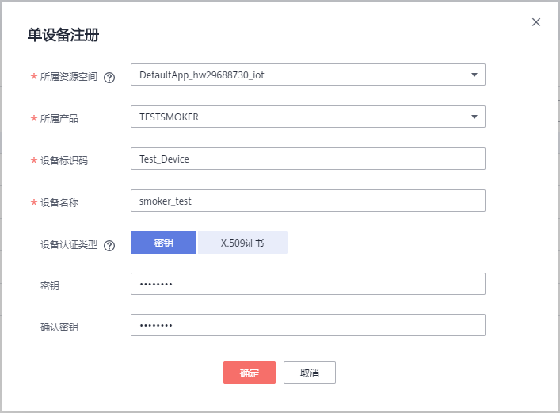
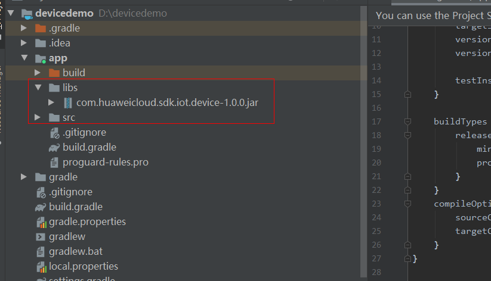

# iot-device-sdk-android开发指南
# 目录

<!-- TOC -->

- [修订记录](#0)
- [前言](#1)
- [SDK简介](#2)
- [准备工作](#3)
- [上传产品模型并注册设备](#4)
- [SDK编译](#5)
- [代码工程配置](#6)
- [设备初始化](#7)
- [属性上报](#8)
- [消息上报](#9)
- [属性读写](#10)
- [消息下发](#11)
- [命令下发](#12)
- [设备影子](#13)
- [OTA升级](#14)
- [文件上传/下载管理](#15)
- [自定义Topic](#16)
- [面向物模型编程](#17)
- [V3接口](#18)
- [开源协议](#19)

<h1 id="0">修订记录</h1>

+ 文档版本01 第一次正式发布（2020-10-13）

<h1 id="1">前言</h1>

本文通过实例讲述iot-device-sdk-android（以下简称SDK）帮助设备用MQTT协议快速连接到华为物联网平台。
<h1 id="2">SDK简介</h1>

SDK面向运算、存储能力较强的嵌入式终端设备，开发者通过调用SDK接口，便可实现设备与物联网平台的上下行通讯。SDK当前支持的功能有：
*  支持设备消息、属性上报、属性读写、命令下发
*  支持OTA升级
*  支持文件上传/下载管理
*  支持密码认证和证书认证两种设备接入方式
*  支持自定义topic
*  支持设备影子查询
*  支持物模型编程
*  兼容V3接口

**SDK目录结构**

iot-device-sdk-java：sdk代码

**第三方类库使用版本**

org.eclipse.paho.client.mqttv3：v1.2.5

gson：v2.8.6

<h1 id="3">准备工作</h1>

*  已安装Android Studio

<h1 id="4">上传产品模型并注册设备</h1>

为了方便体验，我们提供了一个烟感的产品模型，烟感会上报烟雾值、温度、湿度、烟雾报警、还支持响铃报警命令。以烟感例，体验消息上报、属性上报等功能。

1. 访问[设备接入服务](https://www.huaweicloud.com/product/iothub.html)，单击“立即使用”进入设备接入控制台。

3. 访问管理控制台，查看MQTTS设备接入地址，保存该地址。

4. 在设备接入控制台选择“产品”，单击右上角的“创建产品”，在弹出的页面中，填写“产品名称”、“协议类型”、“数据格式”、“厂商名称”、“所属行业”、“设备类型”等信息，然后点击右下角“立即创建”。

   - 协议类型选择“MQTT”；

   - 数据格式选择“JSON”。

5. 产品创建成功后，单击“详情”进入产品详情，在功能定义页面，单击“上传模型文件”，上传烟感产品模型[smokeDetector](https://support.huaweicloud.com/devg-iothub/resource/smokeDetector_cb097d20d77b4240adf1f33d36b3c278_smokeDetector.zip)。

6. 在左侧导航栏，选择“ 设备 > 所有设备”，单击右上角“注册设备”，在弹出的页面中，填写注册设备参数，然后单击“确定”。

7. 设备注册成功后保存设备标识码、设备ID、密钥。

<h1 id="5">SDK编译</h1>

1. 使用Android studio创建Android工程，并设置包名为com.huaweicloud.sdk.iot.device

   

2. 拷贝iot-device-sdk-android工程下java源码到com.huaweicloud.sdk.iot.device包下面

   

3. 配置app目录下build.gradle

   

   build.gradle中添加以下编译脚本

   ```groovy
   task cleanJar(type: Delete){
       //删除存在的
       delete 'build/libs/com.huaweicloud.sdk.iot.device-1.0.0.jar'
       delete 'build/libs/classes/'
   }
   
   task copyJavaclasses(type: Copy) {
   
       //设置拷贝的文件
       from('build/intermediates/javac/release/classes')
   
       //打进jar包后的文件目录
       into('build/libs/')
   }
   
   task makeJar(type: Exec){
       workingDir 'build/libs/'
       commandLine 'cmd', '/c', 'jar cvf com.huaweicloud.sdk.iot.device-1.0.0.jar -C ./ .'
   }
   
   cleanJar.dependsOn(build)
   copyJavaclasses.dependsOn(cleanJar)
   makeJar.dependsOn(copyJavaclasses)
   ```

   build.gradle中dependencies增加以下三个依赖

   ```groovy
   implementation 'com.google.code.gson:gson:2.8.6'
   implementation 'org.eclipse.paho:org.eclipse.paho.client.mqttv3:1.2.5'
   implementation 'androidx.localbroadcastmanager:localbroadcastmanager:1.0.0'
   ```

   Android工程配置完成后，点击build.gradle中task makeJar(请确保java已经添加到环境变量)前绿色箭头，就可以生成jar包。

   

   生成的jar包位于app/build/libs目录下

   

<h1 id="6">代码工程配置</h1>

1. 工程app/libs下添加上文中生成的Jar包

2. build.gradle中添加以下依赖

   ```groovy
   implementation fileTree(dir: "libs", include: ["*.jar"])
   implementation 'androidx.localbroadcastmanager:localbroadcastmanager:1.0.0'
   implementation 'org.eclipse.paho:org.eclipse.paho.client.mqttv3:1.2.5'
   implementation 'com.google.code.gson:gson:2.8.6'
   ```

<h1 id="7">设备初始化</h1>

1. 创建设备。

     设备接入平台时，物联网平台提供密钥和证书两种鉴权方式,如果使用MQTTS，请把下载的bks证书放置到src/main/assets下，<a href="https://support.huaweicloud.com/devg-iothub/iot_02_1004.html#ZH-CN_TOPIC_0187644975__section197481637133318" target="_blank">下载证书文件</a>。

   - 密钥方式接入。

     ```java
     IoTDevice device = new IoTDevice(mContext, "ssl://iot-mqtts.cn-north-4.myhuaweicloud.com:8883", "5eb4cd4049a5ab087d7d4861_demo", "secret");
     ```

   - 证书模式接入。

     华为物联网平台支持设备使用自己的X.509证书接入鉴权。在SDK中使用X.509证书接入时，需自行制作设备证书，并放到调用程序根目录下。SDK调用证书的根目录为\iot-device-feature-test\bin\Debug\certificate。

     接入步骤请参考：

     - 制作设备CA调测证书，详细指导请参考<a href="https://support.huaweicloud.com/usermanual-iothub/iot_01_0055.html" target="_blank">注册X.509证书认证的设备</a>。

     - 制作成功后，生成Keystore，可参考以下代码实现。

       ```java
       String keyPassword = "123456";
       
               Certificate cert = null;
               InputStream inputStream = getAssets().open("deviceCert.pem");
               try {
                   CertificateFactory cf = CertificateFactory.getInstance("X.509");
                   cert = cf.generateCertificate(inputStream);
               } finally {
                   if(inputStream != null){
                       inputStream.close();
                   }
               }
       
               KeyPair keyPair = null;
               InputStream keyInput = getAssets().open("deviceCert.key");
               try{
                   PEMParser pemParser = new PEMParser(new InputStreamReader(keyInput, StandardCharsets.UTF_8));
                   Object object = pemParser.readObject();
                   BouncyCastleProvider provider = new BouncyCastleProvider();
                   JcaPEMKeyConverter converter = new JcaPEMKeyConverter().setProvider(provider);
                   if (object instanceof PEMEncryptedKeyPair) {
                       PEMDecryptorProvider decryptionProvider = new JcePEMDecryptorProviderBuilder().setProvider(provider).build(keyPassword.toCharArray());
                       PEMKeyPair keypair = ((PEMEncryptedKeyPair) object).decryptKeyPair(decryptionProvider);
                       keyPair = converter.getKeyPair(keypair);
                   } else {
                       keyPair = converter.getKeyPair((PEMKeyPair) object);
                   }
               }finally {
                   if(keyInput != null){
                       keyInput.close();
                   }
               }
               if (keyPair == null) {
                   Log.e(TAG, "keystoreCreate: keyPair is null");
                   return;
               }
       
               KeyStore keyStore = .getInstance(KeyStore.getDefaultType());
               keyStore.load(null, null);
               keyStore.setCertificateEntry("certificate", cert);
               keyStore.setKeyEntry("private-key", keyPair.getPrivate(), keyPassword.toCharArray(),
                       new Certificate[]{cert});
       ```

     - 生成KeyStore后调用以下代码，创建设备。

       ```java
       IoTDevice device = new IoTDevice(mContext, "ssl://iot-mqtts.cn-north-4.myhuaweicloud.com:8883", "5eb4cd4049a5ab087d7d4861_demo", keyStore, "secret");
       ```

2. 注册本地广播IotDeviceIntent.ACTION_IOT_DEVICE_CONNECT，用于处理设备初始化后的结果。

   ```java
   LocalBroadcastManager.getInstance(this).registerReceiver(connectBroadcastReceiver, new IntentFilter(IotDeviceIntent.ACTION_IOT_DEVICE_CONNECT));
   
   //广播携带数据
   int broadcastStatus = intent.getIntExtra(BaseConstant.BROADCAST_STATUS, BaseConstant.STATUS_FAIL);
                   switch (broadcastStatus) {
                       case BaseConstant.STATUS_SUCCESS:
                           //设备创建成功
                           break;
                       case BaseConstant.STATUS_FAIL:
                           //设备创建失败
                           //失败原因
                           String error = intent.getStringExtra(COMMON_ERROR);
                           break;
                   }
   ```

3. 设备初始化。

   ```java
   device.init();
   ```

<h1 id="8">属性上报</h1>

4. 接口调用

   ```java
   //创建属性
   List<ServiceProperty> serviceProperties = getServiceProperties();
   
   //上报属性
   device.getClient().reportProperties(serviceProperties);
   ```

2. 注册广播IotDeviceIntent.ACTION_IOT_DEVICE_PROPERTIES_REPORT，用于处理属性上报的结果。

   ```java
   LocalBroadcastManager.getInstance(this).registerReceiver(propertyBroadcastReceiver, new IntentFilter(IotDeviceIntent.ACTION_IOT_DEVICE_PROPERTIES_REPORT));
   
   //广播携带数据
   int broadcastStatus = intent.getIntExtra(BaseConstant.BROADCAST_STATUS, BaseConstant.STATUS_FAIL);
                   switch (broadcastStatus) {
                       case BaseConstant.STATUS_SUCCESS:
                           edtLog.append("上报属性成功!" + "\n");
                           break;
                       case BaseConstant.STATUS_FAIL:
                           String error = intent.getStringExtra(PROPERTIES_REPORT_ERROR);
                           edtLog.append("上报属性失败!失败原因：" + error + "\n");
                           break;
                   }
   ```

<h1 id="9">消息上报</h1>

1. 接口调用

   ```java
   //创建消息
   DeviceMessage deviceMessage = new DeviceMessage();
   
   //上报消息
   device.getClient().reportDeviceMessage(deviceMessage);
   ```

2. 注册广播IotDeviceIntent.ACTION_IOT_DEVICE_SYS_MESSAGES_UP，用于处理消息上报的结果。

   ```java
   LocalBroadcastManager.getInstance(this).registerReceiver(messageBroadcastReceiver, new IntentFilter(IotDeviceIntent.ACTION_IOT_DEVICE_SYS_MESSAGES_UP));
   
   //广播携带数据
   int broadcastStatus = intent.getIntExtra(BaseConstant.BROADCAST_STATUS, BaseConstant.STATUS_FAIL);
                   switch (broadcastStatus){
                       case BaseConstant.STATUS_SUCCESS:
                           edtLog.append("消息上报成功！" + "\n");
                           break;
                       case BaseConstant.STATUS_FAIL:
                           String error = intent.getStringExtra(BaseConstant.COMMON_ERROR);
                           edtLog.append("消息上报失败！失败原因：" + error + "\n");
                           break;
                   }
   ```

<h1 id="10">属性读写</h1>

1. 注册广播IotDeviceIntent.ACTION_IOT_DEVICE_SYS_PROPERTIES_GET和IotDeviceIntent.ACTION_IOT_DEVICE_SYS_PROPERTIES_SET，用于接收平台读写设备属性。

   ```
   //平台查询设备属性广播
   LocalBroadcastManager.getInstance(this).registerReceiver(propertyBroadcastReceiver, new IntentFilter(IotDeviceIntent.ACTION_IOT_DEVICE_SYS_PROPERTIES_GET));
   
   //平台查询设备属性广播携带数据
   requestId = intent.getStringExtra(BaseConstant.REQUEST_ID);
   serviceId = intent.getStringExtra(BaseConstant.SERVICE_ID);
   edtLog.append("平台查询设备属性: " + "requestId=" + requestId + ",serviceId=" + serviceId + "\n");
   
   //平台设置设备属性广播
   LocalBroadcastManager.getInstance(this).registerReceiver(propertyBroadcastReceiver, new IntentFilter(IotDeviceIntent.ACTION_IOT_DEVICE_SYS_PROPERTIES_SET));
   
   //平台设置设备属性广播携带数据
   requestId = intent.getStringExtra(BaseConstant.REQUEST_ID);
   PropsSet propsSet = intent.getParcelableExtra(BaseConstant.SYS_PROPERTIES_SET);
   ```

2. 接口调用

   ```java
   //设备响应平台查询设备属性
   List<ServiceProperty> serviceProperties = getServiceProperties();
   device.getClient().respondPropsGet(requestId, serviceProperties);
   
   //设备响应平台设置设备属性结果
   IotResult iotResult = new IotResult(0, "success");
   device.getClient().respondPropsSet(requestId, iotResult);
   ```

<h1 id="11">消息下发</h1>

1. 注册广播IotDeviceIntent.ACTION_IOT_DEVICE_SYS_MESSAGES_DOWN，用于接收平台下发的消息。

   ```
   LocalBroadcastManager.getInstance(this).registerReceiver(messageBroadcastReceiver, new IntentFilter(IotDeviceIntent.ACTION_IOT_DEVICE_SYS_MESSAGES_DOWN));
   
   //消息下发广播携带数据
   DeviceMessage deviceMessage = intent.getParcelableExtra(BaseConstant.SYS_DOWN_MESSAGES);
   ```

<h1 id="12">命令下发</h1>

1. 注册广播IotDeviceIntent.ACTION_IOT_DEVICE_SYS_COMMANDS,用于接收平台下发的命令。

   ```java
   LocalBroadcastManager.getInstance(this).registerReceiver(messageBroadcastReceiver, new IntentFilter(IotDeviceIntent.ACTION_IOT_DEVICE_SYS_COMMANDS));
   
   //命令下发广播携带数据
    requestId  = intent.getStringExtra(BaseConstant.REQUEST_ID);
    Command command = intent.getParcelableExtra(BaseConstant.SYS_COMMANDS);
   ```

2. 接口调用

   ```java
   //设备响应平台命令执行结果
   //响应实体
   CommandRsp commandRsp = new CommandRsp(CommandRsp.SUCCESS);
   //参数设置
   ......
   //上报响应
   device.getClient().respondCommand(requestId, commandRsp);
   ```

<h1 id="13">设备影子</h1>

1. 接口调用

   ```java
   //设备获取平台影子数据
   ShadowGet shadowGet = new ShadowGet();
   device.getClient().getShadowMessage(shadowGet);
   ```

2. 注册广播IotDeviceIntent.ACTION_IOT_DEVICE_SYS_SHADOW_GET，用于接收平台下发的设备影子数据。

   ```java
   LocalBroadcastManager.getInstance(this).registerReceiver(propertyBroadcastReceiver, new IntentFilter(IotDeviceIntent.ACTION_IOT_DEVICE_SYS_SHADOW_GET));
   
   //设备影子广播携带数据
   requestId = intent.getStringExtra(BaseConstant.REQUEST_ID);
   ShadowMessage shadowMessage = intent.getParcelableExtra(BaseConstant.SHADOW_DATA);
   ```

<h1 id="14">OTA升级</h1>

1. 软件升级。参考<a href=" https://support.huaweicloud.com/usermanual-iothub/iot_01_0047.html#section3 " target="_blank">软件升级指导</a>上传软件包。

2. 固件升级。参考<a href=" https://support.huaweicloud.com/usermanual-iothub/iot_01_0027.html#section3 " target="_blank">固件升级</a>上传固件包。

3. 注册广播IotDeviceIntent.ACTION_IOT_DEVICE_UPGRADE_EVENT，用于接收平台下发升级通知数据，IotDeviceIntent.ACTION_IOT_DEVICE_VERSION_QUERY_EVENT用于接收平台获取版本信息。

   ```java
   //平台下发升级通知广播
   LocalBroadcastManager.getInstance(this).registerReceiver(upgradeBroadcastReceiver,
                   new IntentFilter(IotDeviceIntent.ACTION_IOT_DEVICE_UPGRADE_EVENT));
   
   //平台下发升级通知广播携带数据
   OTAPackage pkg = intent.getParcelableExtra(BaseConstant.OTAPACKAGE_INFO);
   edtLog.append("平台下发升级通知:" + JsonUtil.convertObject2String(pkg) + "\n");
   
   //平台下发获取版本信息广播
   LocalBroadcastManager.getInstance(this).registerReceiver(upgradeBroadcastReceiver,
                   new IntentFilter(IotDeviceIntent.ACTION_IOT_DEVICE_VERSION_QUERY_EVENT));
   ```

4. 接口调用

   ```java
   //设备上报软固件版本
   device.getOtaService().reportVersion(fwVersion, swVersion);
   //设备上报升级状态
   device.getOtaService().reportOtaStatus(resultCode, progress, version, description);
   ```

<h1 id="15">文件上传/下载管理</h1>

1. 接口调用

   ```java
   //获取文件上传URL
   String fileName；
   Map<String, Object> fileAttributes = new HashMap<String, Object>();
   device.getFileManager().getUploadUrl(fileName, fileAttributes);
   
   //上报文件上传结果
   Map<String, Object> paras;
   device.getFileManager().uploadResultReport(paras);
   
   //获取文件下载URL
   String fileName；
   Map<String, Object> fileAttributes = new HashMap<String, Object>();
   device.getFileManager().getDownloadUrl(fileName, fileAttributes);
   
   //上报文件下载结果
   Map<String, Object> paras;
   device.getFileManager().downloadResultReport(paras);
   ```

2. 注册广播IotDeviceIntent.ACTION_IOT_DEVICE_GET_UPLOAD_URL,用于接收平台下发文件上传临时URL通知

   ，IotDeviceIntent.ACTION_IOT_DEVICE_GET_DOWNLOAD_URL用于接收下发文件下载临时URL通知。

   ```java
   LocalBroadcastManager.getInstance(this).registerReceiver(fileManagerBroadcastReceiver,
                   new IntentFilter(IotDeviceIntent.ACTION_IOT_DEVICE_GET_UPLOAD_URL));       LocalBroadcastManager.getInstance(this).registerReceiver(fileManagerBroadcastReceiver,
                   new IntentFilter(IotDeviceIntent.ACTION_IOT_DEVICE_GET_DOWNLOAD_URL));
                   
   //以上两个广播携带数据
   UrlParam urlParam = intent.getParcelableExtra(BaseConstant.URLPARAM_INFO);
   ```

<h1 id="16">自定义Topic</h1>

1. 注册广播IotDeviceIntent.ACTION_IOT_DEVICE_CUSTOMIZED_TOPIC_CONNECT用于接收topic订阅结果，IotDeviceIntent.ACTION_IOT_DEVICE_CUSTOMIZED_TOPIC_MESSAGE用于接收topic下发消息，IotDeviceIntent.ACTION_IOT_DEVICE_CUSTOMIZED_TOPIC_REPORT用于接收topic发布结果。

   ```java
   LocalBroadcastManager.getInstance(this).registerReceiver(customizedTopicReceiver, new IntentFilter(IotDeviceIntent.ACTION_IOT_DEVICE_CUSTOMIZED_TOPIC_CONNECT));
   //topic订阅结果携带数据
   int status = intent.getIntExtra(BROADCAST_STATUS, STATUS_FAIL);
                   String topicName = intent.getStringExtra(CUSTOMIZED_TOPIC_NAME);
                   switch (status){
                       case STATUS_SUCCESS:
                           edtLog.append("订阅Topic成功：" + topicName + "\n");
                           break;
                       case STATUS_FAIL:
                           String errorMessage = intent.getStringExtra(COMMON_ERROR);
                           edtLog.append("订阅Topic失败：" + topicName + "\n");
                           edtLog.append("失败原因：" + errorMessage + "\n");
                           break;
                   }
   
   LocalBroadcastManager.getInstance(this).registerReceiver(customizedTopicReceiver, new IntentFilter(IotDeviceIntent.ACTION_IOT_DEVICE_CUSTOMIZED_TOPIC_MESSAGE));
   //订阅Topic下发消息
   String topicName = intent.getStringExtra(CUSTOMIZED_TOPIC_NAME);
                   RawMessage rawMessage = intent.getParcelableExtra(CUSTOMIZED_TOPIC_MESSAGE);
                   edtLog.append("订阅Topic下发消息：" + topicName + "\n");
                   try {
                       edtLog.append("下发消息内容：" + new String(rawMessage.getPayload(), "UTF-8") + "\n");
                   } catch (UnsupportedEncodingException e) {
                       //
                   }
   
   LocalBroadcastManager.getInstance(this).registerReceiver(customizedTopicReceiver, new IntentFilter(IotDeviceIntent.ACTION_IOT_DEVICE_CUSTOMIZED_TOPIC_REPORT));
   //发布topic
   int status = intent.getIntExtra(BROADCAST_STATUS, STATUS_FAIL);
                   String topicName = intent.getStringExtra(CUSTOMIZED_TOPIC_NAME);
                   switch (status){
                       case STATUS_SUCCESS:
                           edtLog.append("发布Topic成功：" + topicName + "\n");
                           break;
                       case STATUS_FAIL:
                           String errorMessage = intent.getStringExtra(COMMON_ERROR);
                           edtLog.append("发布Topic失败：" + topicName + "\n");
                           edtLog.append("失败原因：" + errorMessage + "\n");
                           break;
                   }
   ```

2. 接口调用

   ```
   //订阅自定义topic
   device.getClient().subscribeTopic(subcribeTopicName, 0);
   
   //发布自定义topic
   device.getClient().publishTopic(publishTopicName, message, 0);
   ```

<h1 id="17">面向物模型编程</h1>

SDK提供了一种更简单的方式，即面向物模型编程。面向物模型编程指基于SDK提供的物模型抽象能力，设备代码按照物模型定义设备服务，然后可以直接访问设备服务（即调用设备服务的属性读写接口），SDK就能自动和平台通讯，完成属性的同步和命令的调用。

相比直接调用客户端接口和平台进行通讯，面向物模型编程更简单，它简化了设备侧代码的复杂度，让设备代码只需要关注业务，而不用关注和平台的通讯过程。这种方式适合多数场景。

1. 按照物模型定义服务类和服务的属性（如果有多个服务，则需要定义多个服务类）

   用@Property注解来表示是一个属性，可以用name指定属性名，如果不指定则使用字段名。

   属性可以加上writeable来控制权限，如果属性只读，则加上writeable = false，如果不加，默认认为可读写。

   ```java
   public static class SmokeDetectorService extends AbstractService {
   
           //按照设备模型定义属性，注意属性的name和类型需要和模型一致，writeable表示属性知否可写，name指定属性名
           @Property(name = "alarm", writeable = true)
           int smokeAlarm = 1;
   
           @Property(name = "smokeConcentration", writeable = false)
           float concentration = 0.0f;
   
           @Property(writeable = false)
           int humidity;
   
           @Property(writeable = false)
           float temperature;
   
   ```

2. 定义服务的命令。设备收到平台下发的命令时，SDK会自动调用这里定义的命令。

   接口入参和返回值的类型是固定的不能修改，否则会出现运行时错误。

   这里定义的是一个响铃报警命令，命令名为ringAlarm 

   ```java
   //定义命令，注意接口入参和返回值类型是固定的不能修改，否则会出现运行时错误
           @DeviceCommand(name = "ringAlarm")
           public CommandRsp alarm(Map<String, Object> paras) {
               int duration = (int) paras.get("duration");
               log.info("ringAlarm  duration = " + duration);
               return new CommandRsp(0);
           }
   
   ```

3. 定义getter和setter接口 

   - 当设备收到平台下发的查询属性以及设备上报属性时，会自动调用getter方法。getter方法需要读取设备的属性值，可以实时到传感器读取或者读取本地的缓存

   - 当设备收到平台下发的设置属性时，会自动调用setter方法。setter方法需要更新设备本地的值。如果属性不支持写操作，setter保留空实现。

     ```java
      //setter和getter接口的命名应该符合java bean规范，sdk会自动调用这些接口
             public int getHumidity() {
     
                 //模拟从传感器读取数据
                 humidity = new Random().nextInt(100);
                 return humidity;
             }
     
             public void setHumidity(int humidity) {
                 //humidity是只读的，不需要实现
             }
     
             public float getTemperature() {
     
                 //模拟从传感器读取数据
                 temperature = new Random().nextInt(100);
                 return temperature;
             }
     
             public void setTemperature(float temperature) {
                 //只读字段不需要实现set接口
             }
     
             public float getConcentration() {
     
                 //模拟从传感器读取数据
                 concentration = new Random().nextFloat()*100.0f;
                 return concentration;
             }
     
             public void setConcentration(float concentration) {
                 //只读字段不需要实现set接口
             }
     
             public int getSmokeAlarm() {
                 return smokeAlarm;
             }
     
             public void setSmokeAlarm(int smokeAlarm) {
     
                 this.smokeAlarm = smokeAlarm;
                 if (smokeAlarm == 0){
                     log.info("alarm is cleared by app");
                 }
             }
     ```

4. 创建服务实例并添加到设备。

   ```java
         //创建设备
           IoTDevice device = new IoTDevice(mContext,serverUri, deviceId, secret);
   
           //创建设备服务
           SmokeDetectorService smokeDetectorService = new SmokeDetectorService();
           device.addService("smokeDetector", smokeDetectorService);
   ```

5. 收到连接成功广播后，具体参考设备初始化，开启周期上报，如果不想周期上报，也可以调用firePropertiesChanged接口手工触发上报 。

   ```java
   smokeDetectorService.enableAutoReport(10000);
   ```

<h1 id="18">V3接口</h1>

1. 接口调用

   ```java
   //订阅V3接口
   device.getClient().subscribeTopicV3("/huawei/v1/devices/" + deviceId + "/command/json", 0);
   
   //V3数据上报
   DevicePropertiesV3 devicePropertiesV3 = new DevicePropertiesV3();
   device.getClient().reportPropertiesV3(devicePropertiesV3);
   
   //V3命令响应
   CommandRspV3 commandRspV3 = new CommandRspV3("deviceRsp", commandV3.getMid(), 0);
   device.getClient().responseCommandV3(commandRspV3);
   ```

2. 注册广播IotDeviceIntent.ACTION_IOT_DEVICE_PROPERTIES_REPORT_V3用于反馈V3数据上报结果，IotDeviceIntent.ACTION_IOT_DEVICE_SYS_COMMANDS_V3用于接收平台下发的V3命令。

   ```java
   LocalBroadcastManager.getInstance(this).registerReceiver(v3Receiver, new IntentFilter(IotDeviceIntent.ACTION_IOT_DEVICE_PROPERTIES_REPORT_V3));
   //上报数据结果
   int  broadcastStatus = intent.getIntExtra(BaseConstant.BROADCAST_STATUS, BaseConstant.STATUS_FAIL);
                   switch (broadcastStatus){
                       case BaseConstant.STATUS_SUCCESS:
                           edtLog.append("V3上报数据成功" + "\n");
                           break;
                       case BaseConstant.STATUS_FAIL:
                           String errorMessage = intent.getStringExtra(BaseConstant.PROPERTIES_REPORT_ERROR);
                           edtLog.append("V3上报数据失败: " + errorMessage + "\n");
                           break;
                   }
   
   LocalBroadcastManager.getInstance(this).registerReceiver(v3Receiver, new IntentFilter(IotDeviceIntent.ACTION_IOT_DEVICE_SYS_COMMANDS_V3));
   //下发的V3命令
   commandV3 = intent.getParcelableExtra(BaseConstant.SYS_COMMANDS);
   ```

<h1 id="19">开源协议</h1>

- 遵循BSD-3开源许可协议