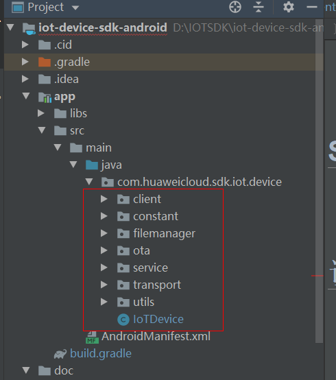
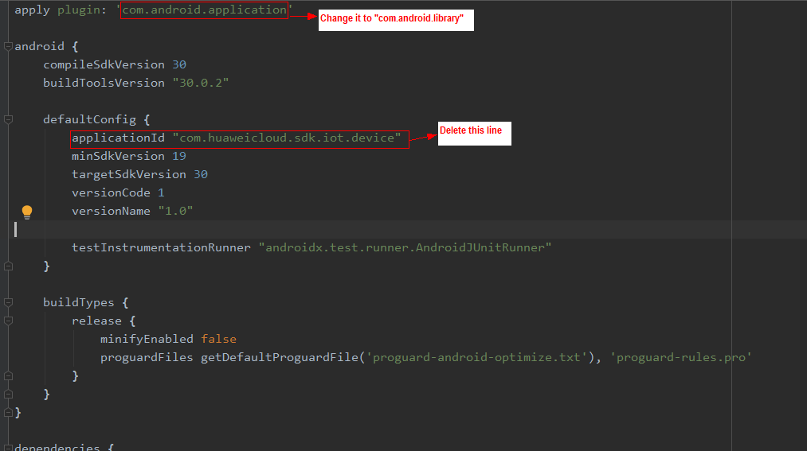
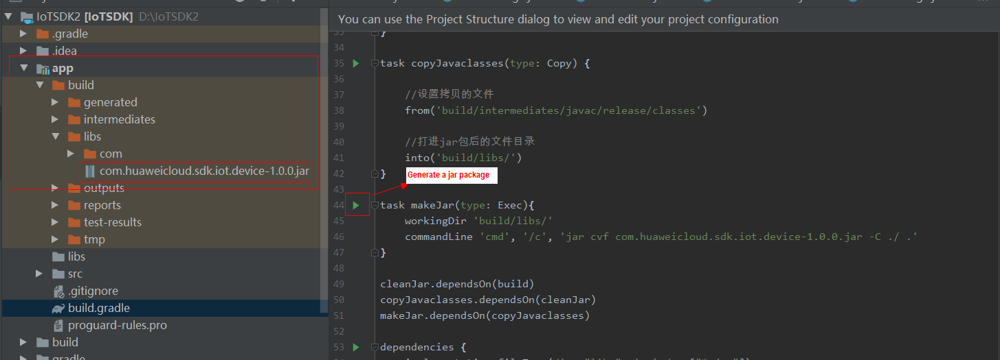

English | [简体中文](./README_CN.md) 

# iot-device-sdk-android Development Guide

# Contents

<!-- TOC -->

- [Change History](#0)
- [About This Document](#1)
- [SDK Overview](#2)
- [Preparations](#3)
- [Uploading a Product Model and Registering a Device](#4)
- [Compiling the SDK](#5)
- [Configuring a Code Project](#6)
- [Initiating a Device](#7)
- [Reporting Properties](#8)
- [Reporting a Message](#9)
- [Reading/Writing Properties](#10)
- [Delivering a Message](#11)
- [Delivering a Command](#12)
- [Using a Device Shadow](#13)
- [Performing an OTA Upgrade](#14)
- [Uploading or Downloading a File](#15)
- [Customizing a Topic](#16)
- [Object-oriented Programming](#17)
- [V3 APIs](#18)
- [Open-Source Protocols](#19)

<h1 id="0">Version Updates</h1>

|  Version | Change Type  | Function Description  |
| ------------ | ------------ | ------------ |
|  1.0.0 | Publishment  |  Provides basic device access capabilities. |

<h1 id="1">About This Document</h1>
This document uses an example to describe how to use iot-device-sdk-android (SDK for short) to quickly connect MQTT devices to the HUAWEI CLOUD IoT platform.
<h1 id="2">SDK Overview</h1>
The SDK is designed for embedded devices with powerful computing and storage capabilities. You can call SDK APIs to implement communication between devices and the platform. The SDK currently supports:
* Device message reporting, property reporting, property reading and writing, and command delivery
* Over-the-air (OTA) upgrades
* File uploads and downloads
* Secret authentication and certificate authentication for device access
* Topic customization
* Device shadow query
* Object-oriented programming
* Compatibility with V3 APIs

**SDK Directory Structure**

iot-device-sdk-java: SDK code

**Version of third-party class libraries**

org.eclipse.paho.client.mqttv3: v1.2.5

gson: v2.8.6

<h1 id="3">Preparations</h1>
* Ensure that you have installed Android Studio.

<h1 id="4">Uploading a Product Model and Registering a Device</h1>
We provide a smoke detector product model for your experience. The smoke detector can report the smoke density, temperature, humidity, and smoke alarms, and execute the ring alarm command. The following procedures use the smoke detector as an example to show you SDK functions, such as message reporting and property reporting.

1. Visit [IoT Device Access (IoTDA)](https://www.huaweicloud.com/en-us/product/iothub.html) and click **Use Now** to access the IoTDA console.

2. View the MQTTS device access address, and save it. 

3. On the IoTDA console, choose **Products** in the navigation pane, and click **Create Product** in the upper right corner. On the displayed page, specify the product name, protocol, data type, manufacturer, industry, and device type, and click **Create**.

   - Set **Protocol** to **MQTT**.

   - Set **Data Type** to **JSON**. 

4. After the product is created, click **View** to access its details. On the **Model Definition** page, click **Import Local Profile** to upload the smoke detector product model [smokeDetector](https://support.huaweicloud.com/devg-iothub/resource/smokeDetector_cb097d20d77b4240adf1f33d36b3c278_smokeDetector.zip).

5. In the navigation pane, choose **Device** > **All Devices**. On the page displayed, click **Individual Register** in the upper right corner. On the page displayed, set device registration parameters and click **OK**. 

6. After the device is registered, save the node ID, device ID, and secret.

<h1 id="5">Compiling the SDK</h1>
1. Use Android Studio to create an Android project and set the package name to **com.huaweicloud.sdk.iot.device**.

   

2. Copy the Java source code of the iot-device-sdk-android project to the **com.huaweicloud.sdk.iot.device** package.

   

3. Configure the **build.gradle** file in the **app** directory.

   

    Add the following compilation scripts to the **build.gradle** file:

   ```groovy
   task cleanJar(type: Delete){
       // Delete the existing JAR package.
       delete 'build/libs/com.huaweicloud.sdk.iot.device-1.0.0.jar'
       delete 'build/libs/classes/'
   }

   task copyJavaclasses(type: Copy) {

       // Copy files.
       from('build/intermediates/javac/release/classes')

       // Store the JAR package.
       into('build/libs/')
   }

   task makeJar(type: Exec){
       workingDir 'build/libs/'
       commandLine 'cmd', '/c', 'jar cvf com.huaweicloud.sdk.iot.device-1.0.0.jar -C ./ .'
   }

   cleanJar.dependsOn(build)
   copyJavaclasses.dependsOn(cleanJar)
   makeJar.dependsOn(copyJavaclasses)
   ```

   Add the following three dependencies to the **build.gradle** file:

   ```groovy
   implementation 'com.google.code.gson:gson:2.8.6'
   implementation 'org.eclipse.paho:org.eclipse.paho.client.mqttv3:1.2.5'
   implementation 'androidx.localbroadcastmanager:localbroadcastmanager:1.0.0'
   ```

   After the Android project is configured, click the green arrow before **task makeJar** in the **build.gradle** file to generate a JAR package. However, you must ensure that the Java environment variable is added.

   

   The generated JAR package is stored in the **app/build/libs** directory.

   

<h1 id="6">Configuring a Code Project</h1>
1. Add the generated JAR package to the **app/libs** directory.

2. Add the following dependencies to the **build.gradle** file:

   ```groovy
   implementation fileTree(dir: "libs", include: ["*.jar"])
   implementation 'androidx.localbroadcastmanager:localbroadcastmanager:1.0.0'
   implementation 'org.eclipse.paho:org.eclipse.paho.client.mqttv3:1.2.5'
   implementation 'com.google.code.gson:gson:2.8.6'
   ```

<h1 id="7">Initializing a Device</h1>
1. Create a device.

     Secret authentication and certificate authentication are available for device access. If MQTTS is used, download <a href="https://support.huaweicloud.com/en-us/devg-iothub/iot_02_1004.html#ZH-CN_TOPIC_0187644975__section197481637133318" target="_blank">a certificate of the bouncy castle keystore (BKS) format</a>, and place it in the **src/main/assets** directory.

   - Access using a secret.

     ```java
     IoTDevice device = new IoTDevice(mContext, "ssl://iot-mqtts.cn-north-4.myhuaweicloud.com:8883", "5eb4cd4049a5ab087d7d4861_demo", "secret");
     ```

   - Access using a certificate.

     The platform allows devices to use their own X.509 certificates for access authentication. Before using the X.509 certificate for access in the SDK, create a device certificate and place it in the root directory (**\iot-device-feature-test\bin\Debug\certificate**) of the calling program.  

     The access procedures are as follows:

     - Create a device CA commissioning certificate. For details, see <a href="https://support.huaweicloud.com/en-us/usermanual-iothub/iot_01_0055.html" target="_blank">Registering a Device Authenticated by an X.509 Certificate</a>.

     - After the certificate is created, refer to the following code to generate a KeyStore:

       ```java
       String keyPassword = "123456";

               Certificate cert = null;
               InputStream inputStream = getAssets().open("deviceCert.pem");
               try {
                   CertificateFactory cf = CertificateFactory.getInstance("X.509");
                   cert = cf.generateCertificate(inputStream);
               } finally {
                   if(inputStream != null){
                       inputStream.close();
                   }
               }

               KeyPair keyPair = null;
               InputStream keyInput = getAssets().open("deviceCert.key");
               try{
                   PEMParser pemParser = new PEMParser(new InputStreamReader(keyInput, StandardCharsets.UTF_8));
                   Object object = pemParser.readObject();
                   BouncyCastleProvider provider = new BouncyCastleProvider();
                   JcaPEMKeyConverter converter = new JcaPEMKeyConverter().setProvider(provider);
                   if (object instanceof PEMEncryptedKeyPair) {
                       PEMDecryptorProvider decryptionProvider = new JcePEMDecryptorProviderBuilder().setProvider(provider).build(keyPassword.toCharArray());
                       PEMKeyPair keypair = ((PEMEncryptedKeyPair) object).decryptKeyPair(decryptionProvider);
                       keyPair = converter.getKeyPair(keypair);
                   } else {
                       keyPair = converter.getKeyPair((PEMKeyPair) object);
                   }
               }finally {
                   if(keyInput != null){
                       keyInput.close();
                   }
               }
               if (keyPair == null) {
                   Log.e(TAG, "keystoreCreate: keyPair is null");
                   return;
               }

               KeyStore keyStore = .getInstance(KeyStore.getDefaultType());
               keyStore.load(null, null);
               keyStore.setCertificateEntry("certificate", cert);
               keyStore.setKeyEntry("private-key", keyPair.getPrivate(), keyPassword.toCharArray(),
                       new Certificate[]{cert});
       ```

     - After the KeyStore is generated, call the following code to create a device:

       ```java
       IoTDevice device = new IoTDevice(mContext, "ssl://iot-mqtts.cn-north-4.myhuaweicloud.com:8883", "5eb4cd4049a5ab087d7d4861_demo", keyStore, "secret");
       ```

2. Register the local broadcast **IotDeviceIntent.ACTION_IOT_DEVICE_CONNECT** to process the device initialization result.

   ```java
   LocalBroadcastManager.getInstance(this).registerReceiver(connectBroadcastReceiver, new IntentFilter(IotDeviceIntent.ACTION_IOT_DEVICE_CONNECT));

   // Data carried in the broadcast
   int broadcastStatus = intent.getIntExtra(BaseConstant.BROADCAST_STATUS, BaseConstant.STATUS_FAIL);
                   switch (broadcastStatus) {
                       case BaseConstant.STATUS_SUCCESS:
                           // The device is created.
                           break;
                       case BaseConstant.STATUS_FAIL:
                           // The device creation fails.
                           // Cause
                           String error = intent.getStringExtra(COMMON_ERROR);
                           break;
                   }
   ```

3. Initialize the device.

   ```java
   device.init();
   ```

<h1 id="8">Reporting Properties</h1>
1. Call APIs.

   ```java
   // Create device properties.
   List<ServiceProperty> serviceProperties = getServiceProperties();

   // Report device properties.
   device.getClient().reportProperties(serviceProperties);
   ```

2. Register the **IotDeviceIntent.ACTION_IOT_DEVICE_PROPERTIES_REPORT** broadcast to process the property reporting result.

   ```java
   LocalBroadcastManager.getInstance(this).registerReceiver(propertyBroadcastReceiver, new IntentFilter(IotDeviceIntent.ACTION_IOT_DEVICE_PROPERTIES_REPORT));

   // Data carried in the broadcast
   int broadcastStatus = intent.getIntExtra(BaseConstant.BROADCAST_STATUS, BaseConstant.STATUS_FAIL);
                   switch (broadcastStatus) {
                       case BaseConstant.STATUS_SUCCESS:
                           edtLog.append("The properties are reported." + "\n");
                           break;
                       case BaseConstant.STATUS_FAIL:
                           String error = intent.getStringExtra(PROPERTIES_REPORT_ERROR);
                           edtLog.append("The properties fail to report. Cause: " + error + "\n");
                           break;
                   }
   ```

<h1 id="9">Reporting a Message</h1>
1. Call APIs.

   ```java
   // Create a device message.
   DeviceMessage deviceMessage = new DeviceMessage();

   // Report the device message.
   device.getClient().reportDeviceMessage(deviceMessage);
   ```

2. Register the **IotDeviceIntent.ACTION_IOT_DEVICE_SYS_MESSAGES_UP** broadcast to process the message reporting result.

   ```java
   LocalBroadcastManager.getInstance(this).registerReceiver(messageBroadcastReceiver, new IntentFilter(IotDeviceIntent.ACTION_IOT_DEVICE_SYS_MESSAGES_UP));

   // Data carried in the broadcast
   int broadcastStatus = intent.getIntExtra(BaseConstant.BROADCAST_STATUS, BaseConstant.STATUS_FAIL);
                   switch (broadcastStatus){
                       case BaseConstant.STATUS_SUCCESS:
                           edtLog.append("The message is reported. " + "\n");
                           break;
                       case BaseConstant.STATUS_FAIL:
                           String error = intent.getStringExtra(BaseConstant.COMMON_ERROR);
                           edtLog.append("The message fails to report. Cause: " + error + "\n");
                           break;
                   }
   ```

<h1 id="10">Reading/Writing Properties</h1>
1. Register the **IotDeviceIntent.ACTION_IOT_DEVICE_SYS_PROPERTIES_GET** and **IotDeviceIntent.ACTION_IOT_DEVICE_SYS_PROPERTIES_SET** broadcasts to receive the platform's request for reading and writing device properties.

   ```
   // Broadcast receiving the platform's request for querying device properties
   LocalBroadcastManager.getInstance(this).registerReceiver(propertyBroadcastReceiver, new IntentFilter(IotDeviceIntent.ACTION_IOT_DEVICE_SYS_PROPERTIES_GET));

   // Data carried in the broadcast
   requestId = intent.getStringExtra(BaseConstant.REQUEST_ID);
   serviceId = intent.getStringExtra(BaseConstant.SERVICE_ID);
   edtLog.append("The platform queries device properties: " + "requestId=" + requestId + ",serviceId=" + serviceId + "\n")

   // Broadcast receiving the platform's request for setting device properties
   LocalBroadcastManager.getInstance(this).registerReceiver(propertyBroadcastReceiver, new IntentFilter(IotDeviceIntent.ACTION_IOT_DEVICE_SYS_PROPERTIES_SET));

   // Data carried in the broadcast
   requestId = intent.getStringExtra(BaseConstant.REQUEST_ID);
   PropsSet propsSet = intent.getParcelableExtra(BaseConstant.SYS_PROPERTIES_SET);
   ```

2. Call APIs.

   ```java
   // Respond to the platform's request for querying device properties.
   List<ServiceProperty> serviceProperties = getServiceProperties();
   device.getClient().respondPropsGet(requestId, serviceProperties);

   // Return the response result.
   IotResult iotResult = new IotResult(0, "success");
   device.getClient().respondPropsSet(requestId, iotResult);
   ```

<h1 id="11">Delivering a Message</h1>
Register the **IotDeviceIntent.ACTION_IOT_DEVICE_SYS_MESSAGES_DOWN** broadcast to receive messages delivered by the platform.

```
LocalBroadcastManager.getInstance(this).registerReceiver(messageBroadcastReceiver, new IntentFilter(IotDeviceIntent.ACTION_IOT_DEVICE_SYS_MESSAGES_DOWN));

// Data carried in the broadcast
DeviceMessage deviceMessage = intent.getParcelableExtra(BaseConstant.SYS_DOWN_MESSAGES);
```

<h1 id="12">Delivering a Command</h1>
1. Register the **IotDeviceIntent.ACTION_IOT_DEVICE_SYS_COMMANDS** broadcast to receive commands delivered by the platform.

   ```java
   LocalBroadcastManager.getInstance(this).registerReceiver(messageBroadcastReceiver, new IntentFilter(IotDeviceIntent.ACTION_IOT_DEVICE_SYS_COMMANDS));

   // Data carried in the broadcast
    requestId  = intent.getStringExtra(BaseConstant.REQUEST_ID);
    Command command = intent.getParcelableExtra(BaseConstant.SYS_COMMANDS);
   ```

2. Call APIs.

   ```java
   // Respond to the platform's commands.
   // Response entity
   CommandRsp commandRsp = new CommandRsp(CommandRsp.SUCCESS);
   // Parameter settings
   ......
   // Return the response result.
   device.getClient().respondCommand(requestId, commandRsp);
   ```

<h1 id="13">Using a Device Shadow</h1>
1. Call APIs.

   ```java
   // Obtain the device shadow data delivered by the platform.
   ShadowGet shadowGet = new ShadowGet();
   device.getClient().getShadowMessage(shadowGet);
   ```

2. Register the **IotDeviceIntent.ACTION_IOT_DEVICE_SYS_SHADOW_GET** broadcast to receive the device shadow data delivered by the platform.

   ```java
   LocalBroadcastManager.getInstance(this).registerReceiver(propertyBroadcastReceiver, new IntentFilter(IotDeviceIntent.ACTION_IOT_DEVICE_SYS_SHADOW_GET));

   // Data carried in the broadcast
   requestId = intent.getStringExtra(BaseConstant.REQUEST_ID);
   ShadowMessage shadowMessage = intent.getParcelableExtra(BaseConstant.SHADOW_DATA);
   ```

<h1 id="14">Performing an OTA Upgrade</h1>
1.  Update software by following the instructions provided in <a href=" https://support.huaweicloud.com/en-us/usermanual-iothub/iot_01_0047.html#section3 " target="_blank">Uploading a Software Package</a>.

2.  Upgrade firmware by following the instructions provided in <a href=" https://support.huaweicloud.com/en-us/usermanual-iothub/iot_01_0027.html#section3 " target="_blank">Uploading a Firmware Package</a>.

3. Register the **IotDeviceIntent.ACTION_IOT_DEVICE_UPGRADE_EVENT** broadcast to receive the platform's upgrade notification, and the **IotDeviceIntent.ACTION_IOT_DEVICE_VERSION_QUERY_EVENT** broadcast to receive the platform's request for version information.

   ```java
   // Broadcast for receiving the platform's upgrade notification
   LocalBroadcastManager.getInstance(this).registerReceiver(upgradeBroadcastReceiver,
                   new IntentFilter(IotDeviceIntent.ACTION_IOT_DEVICE_UPGRADE_EVENT));

   // Data carried in the broadcast
   OTAPackage pkg = intent.getParcelableExtra(BaseConstant.OTAPACKAGE_INFO);
   edtLog.append("The platform delivers an upgrade notification: "+ JsonUtil.convertObject2String(pkg) + "\n");

   // Broadcast for receiving the platform's request for version information
   LocalBroadcastManager.getInstance(this).registerReceiver(upgradeBroadcastReceiver,
                   new IntentFilter(IotDeviceIntent.ACTION_IOT_DEVICE_VERSION_QUERY_EVENT));
   ```

4. Call APIs.

   ```java
   // Report the software/firmware version.
   device.getOtaService().reportVersion(fwVersion, swVersion);
   // Report the upgrade state.
   device.getOtaService().reportOtaStatus(resultCode, progress, version, description);
   ```

<h1 id="15">Uploading or Downloading a File</h1>
1. Call APIs.

   ```java
   // Obtain the URL for file upload.
   String fileName;
   Map<String, Object> fileAttributes = new HashMap<String, Object>();
   device.getFileManager().getUploadUrl(fileName, fileAttributes);

   // Report the file upload result.
   Map<String, Object> paras;
   device.getFileManager().uploadResultReport(paras);

   // Obtain the URL for file download.
   String fileName;
   Map<String, Object> fileAttributes = new HashMap<String, Object>();
   device.getFileManager().getDownloadUrl(fileName, fileAttributes);

   // Report the file download result.
   Map<String, Object> paras;
   device.getFileManager().downloadResultReport(paras);
   ```

2. Register the **IotDeviceIntent.ACTION_IOT_DEVICE_GET_UPLOAD_URL** broadcast to receive the platform's notification of the temporary file upload URL, and the **IotDeviceIntent.ACTION_IOT_DEVICE_GET_DOWNLOAD_URL** broadcast to receive the platform's notification of the temporary file download URL.

   ```java
   LocalBroadcastManager.getInstance(this).registerReceiver(fileManagerBroadcastReceiver,
                   new IntentFilter(IotDeviceIntent.ACTION_IOT_DEVICE_GET_UPLOAD_URL));       LocalBroadcastManager.getInstance(this).registerReceiver(fileManagerBroadcastReceiver,
                   new IntentFilter(IotDeviceIntent.ACTION_IOT_DEVICE_GET_DOWNLOAD_URL));
                   
   // Data carried in the preceding two broadcasts
   UrlParam urlParam = intent.getParcelableExtra(BaseConstant.URLPARAM_INFO);
   ```

<h1 id="16">Customizing a Topic</h1>
1. Register the **IotDeviceIntent.ACTION_IOT_DEVICE_CUSTOMIZED_TOPIC_CONNECT** broadcast to receive the topic subscription result, the **IotDeviceIntent.ACTION_IOT_DEVICE_CUSTOMIZED_TOPIC_MESSAGE** broadcast to receive messages delivered by the topic, and the **IotDeviceIntent.ACTION_IOT_DEVICE_CUSTOMIZED_TOPIC_REPORT** broadcast to receive the topic publication result.

   ```java
   LocalBroadcastManager.getInstance(this).registerReceiver(customizedTopicReceiver, new IntentFilter(IotDeviceIntent.ACTION_IOT_DEVICE_CUSTOMIZED_TOPIC_CONNECT));
   // Data carried in the broadcast
   int status = intent.getIntExtra(BROADCAST_STATUS, STATUS_FAIL);
                   String topicName = intent.getStringExtra(CUSTOMIZED_TOPIC_NAME);
                   switch (status){
                       case STATUS_SUCCESS:
                           edtLog.append("The topic is subscribed: " + topicName + "\n");
                           break;
                       case STATUS_FAIL:
                           String errorMessage = intent.getStringExtra(COMMON_ERROR);
                           edtLog.append("The topic fails to subscribe: " + topicName + "\n");
                           edtLog.append("Cause: " + errorMessage + "\n" ");
                           break;
                   }

   LocalBroadcastManager.getInstance(this).registerReceiver(customizedTopicReceiver, new IntentFilter(IotDeviceIntent.ACTION_IOT_DEVICE_CUSTOMIZED_TOPIC_MESSAGE));
   // Subscribe to messages delivered by a topic.
   String topicName = intent.getStringExtra(CUSTOMIZED_TOPIC_NAME);
                   RawMessage rawMessage = intent.getParcelableExtra(CUSTOMIZED_TOPIC_MESSAGE);
                   edtLog.append("Subscribe to messages delivered by a topic: " + topicName + "\n");
                   try {
                       edtLog.append("Delivered message: "+ new String(rawMessage.getPayload()), "UTF-8") + "\n");
                   } catch (UnsupportedEncodingException e) {
                       //
                   }

   LocalBroadcastManager.getInstance(this).registerReceiver(customizedTopicReceiver, new IntentFilter(IotDeviceIntent.ACTION_IOT_DEVICE_CUSTOMIZED_TOPIC_REPORT));
   // Publish the topic.
   int status = intent.getIntExtra(BROADCAST_STATUS, STATUS_FAIL);
                   String topicName = intent.getStringExtra(CUSTOMIZED_TOPIC_NAME);
                   switch (status){
                       case STATUS_SUCCESS:
                           edtLog.append("The topic is published: " + topicName + "\n");
                           break;
                       case STATUS_FAIL:
                           String errorMessage = intent.getStringExtra(COMMON_ERROR);
                           edtLog.append("The topic fails to publish: " + topicName + "\n".";
                           edtLog.append("Cause: " + errorMessage + "\n" ");
                           break;
                   }
   ```

2. Call APIs.

   ```
   // Subscribe to a custom topic.
   device.getClient().subscribeTopic(subcribeTopicName, 0);

   // Publish the custom topic.
   device.getClient().publishTopic(publishTopicName, message, 0);
   ```

<h1 id="17">Object-oriented Programming</h1>
The SDK provides a simpler method, that is, object-oriented programming. You can use the product model capabilities provided by the SDK to define device services and call the property reading/writing API to access device services. In this way, the SDK can automatically communicate with the platform to synchronize properties and call commands.

Object-oriented programming enables the developers to focus only on services rather than communication with the platform. This method is much easier than calling client APIs and suitable for most scenarios.  

1. Define the service class and properties based on the product model. (If there are multiple services, you need to define multiple service classes.)

   The **@Property** annotation is used to indicate a property. You can use **name** to specify the property name, or use the field name.

   **writeable** can be added to specify whether a property is writeable. **writeable = false** indicates that the property can only be read. If **writeable** is not added, then the property can be both read and written.

   ```java
   public static class SmokeDetectorService extends AbstractService {

           // Define a property according to the device model. Note that the name and type of the property must be the same as those set for the model. **writeable** specifies whether the property is writeable, and **name** specifies the property name.
           @Property(name = "alarm", writeable = true)
           int smokeAlarm = 1;

           @Property(name = "smokeConcentration", writeable = false)
           float concentration = 0.0f;

           @Property(writeable = false)
           int humidity;

           @Property(writeable = false)
           float temperature;

   ```

2. Define service commands. The SDK will automatically call service commands that the device received from the platform.

   The types of input parameters and return values are fixed and cannot be changed. Otherwise, errors may occur during running.

   Here a command named **ringAlarm** is defined.

   ```java
   // Define a command. Note that the types of input parameters and return values are fixed and cannot be changed. Otherwise, errors may occur during running.
           @DeviceCommand(name = "ringAlarm")
           public CommandRsp alarm(Map<String, Object> paras) {
               int duration = (int) paras.get("duration");
               log.info("ringAlarm  duration = " + duration);
               return new CommandRsp(0);
           }

   ```

3. Define the **getter** and **setter** methods.

   - The **getter** method is automatically called when a device receives the platform's request for querying and reporting its properties. The **getter** method reads device properties from the sensor in real time or from the local cache.

   - The **setter** method is automatically called when a device receives the platform's request for setting its properties. The **setter** method updates the local values of the device. If a property is not writeable, leave the **setter** method not implemented.

     ```java
      // The names of the **setter** and **getter** methods must comply with the **Java bean** specifications. The SDK automatically calls these methods.
             public int getHumidity() {

                  // Simulate reading data from a sensor.
                 humidity = new Random().nextInt(100);
                 return humidity;
             }

             public void setHumidity(int humidity) {
                  // The **set** method does not need to be implemented for read-only fields.
             }

             public float getTemperature() {

                 // Simulate reading data from the sensor.
                 temperature = new Random().nextInt(100);
                 return temperature;
             }

             public void setTemperature(float temperature) {
                  // The **set** method does not need to be implemented for read-only fields.
             }

             public float getConcentration() {

                 // Simulate reading data from the sensor.
                 concentration = new Random().nextFloat()*100.0f;
                 return concentration;
             }

             public void setConcentration(float concentration) {
                  // The **set** method does not need to be implemented for read-only fields.
             }

             public int getSmokeAlarm() {
                 return smokeAlarm;
             }

             public void setSmokeAlarm(int smokeAlarm) {

                 this.smokeAlarm = smokeAlarm;
                 if (smokeAlarm == 0){
                     log.info("alarm is cleared by app");
                 }
             }
     ```

4. Create a service instance and add it to a device.

   ```java
         // Create a device.
           IoTDevice device = new IoTDevice(mContext,serverUri, deviceId, secret);

           // Create a device service.
           SmokeDetectorService smokeDetectorService = new SmokeDetectorService();
           device.addService("smokeDetector", smokeDetectorService);
   ```

5. After receiving the broadcast message of a successful connection, enable periodic reporting by following the instructions provided in [Initiating a Device](#7), or call the **firePropertiesChanged** method to manually trigger reporting.

   ```java
   smokeDetectorService.enableAutoReport(10000);
   ```

<h1 id="18">V3 APIs</h1>
1. Call APIs.

   ```java
    // Subscribe to a V3 API.
   device.getClient().subscribeTopicV3("/huawei/v1/devices/" + deviceId + "/command/json", 0);

   // Report the V3 API data.
   DevicePropertiesV3 devicePropertiesV3 = new DevicePropertiesV3();
   device.getClient().reportPropertiesV3(devicePropertiesV3);

   // Respond to a V3 API command.
   CommandRspV3 commandRspV3 = new CommandRspV3("deviceRsp", commandV3.getMid(), 0);
   device.getClient().responseCommandV3(commandRspV3);
   ```

2. Register the **IotDeviceIntent.ACTION_IOT_DEVICE_PROPERTIES_REPORT_V3** broadcast to provide the V3 API data reporting result, and the **IotDeviceIntent.ACTION_IOT_DEVICE_SYS_COMMANDS_V3** broadcast to receive the V3 API command delivered by the platform.

   ```java
   LocalBroadcastManager.getInstance(this).registerReceiver(v3Receiver, new IntentFilter(IotDeviceIntent.ACTION_IOT_DEVICE_PROPERTIES_REPORT_V3));
   // Return the result of V3 API data reporting.
   int  broadcastStatus = intent.getIntExtra(BaseConstant.BROADCAST_STATUS, BaseConstant.STATUS_FAIL);
                   switch (broadcastStatus){
                       case BaseConstant.STATUS_SUCCESS:
                           edtLog.append("The V3 API data is reported." + "\n");
                           break;
                       case BaseConstant.STATUS_FAIL:
                           String errorMessage = intent.getStringExtra(BaseConstant.PROPERTIES_REPORT_ERROR);
                           edtLog.append("The V3 API data fails to report: " + errorMessage + "\n");
                           break;
                   }

   LocalBroadcastManager.getInstance(this).registerReceiver(v3Receiver, new IntentFilter(IotDeviceIntent.ACTION_IOT_DEVICE_SYS_COMMANDS_V3));
    // Data carried in the broadcast for receiving V3 API commands
   commandV3 = intent.getParcelableExtra(BaseConstant.SYS_COMMANDS);
   ```

<h1 id="19">Open-Source Protocols</h1>
- Complying with the BSD-3 open-source license agreement

